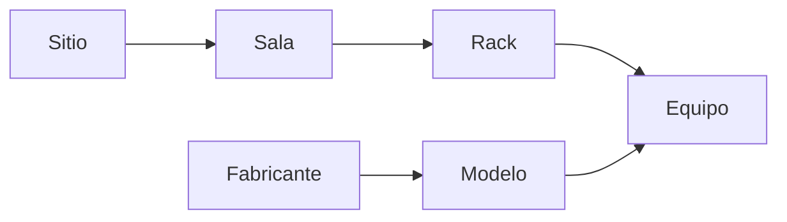
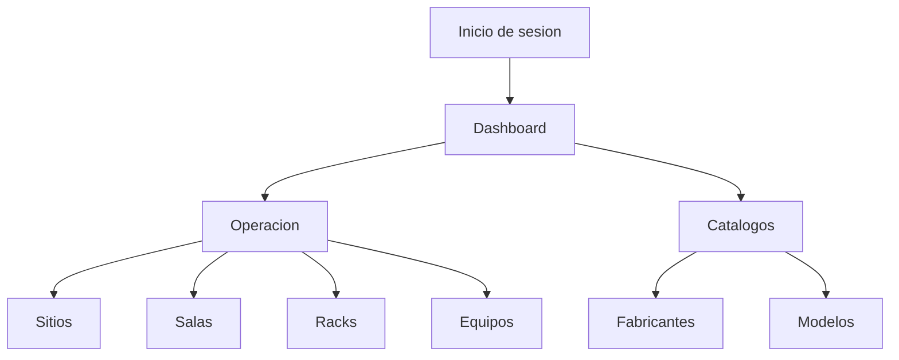
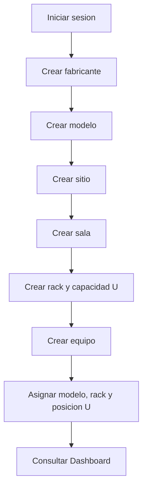
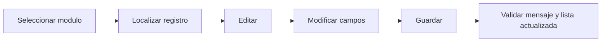

# MANUAL DE USUARIO
## DCIM System - Gestion de Datacenter

**Evidencia:** GA10-220501097-AA11-EV01  
**Version del documento:** 1.0  
**Fecha:** 25 de septiembre de 2026  
**Elaborado por:** Aprendiz del programa de formacion  
**Aplicacion:** DCIM System

---

## Control de versiones

| Version | Fecha | Descripcion | Responsable |
|---|---|---|---|
| 1.0 | 25/09/2026 | Version inicial del manual de usuario | Aprendiz del programa |

## Tabla de contenido

1. [Introduccion](#1-introduccion)
2. [Objetivo del sistema](#2-objetivo-del-sistema)
3. [Alcance funcional y organizacional](#3-alcance-funcional-y-organizacional)
4. [Prerequisitos y configuracion](#4-prerequisitos-y-configuracion)
5. [Ingreso y seguridad](#5-ingreso-y-seguridad)
6. [Organizacion general del aplicativo](#6-organizacion-general-del-aplicativo)
7. [Funciones y utilizacion](#7-funciones-y-utilizacion)
8. [Flujos de trabajo](#8-flujos-de-trabajo)
9. [Solucion de problemas](#9-solucion-de-problemas)
10. [Preguntas frecuentes](#10-preguntas-frecuentes)
11. [Datos de contacto](#11-datos-de-contacto)
12. [Glosario](#12-glosario)
13. [Fuentes consultadas](#13-fuentes-consultadas)

---

## 1. Introduccion

DCIM System es una aplicacion web para administrar la infraestructura fisica de un centro de datos. Permite organizar la informacion de sitios, salas, racks y equipos, relacionarla con fabricantes y modelos, y consultar indicadores de capacidad y ocupacion.

Este manual orienta al usuario final en el ingreso al aplicativo, la navegacion, la consulta y el registro de informacion. Las instrucciones corresponden a la version implementada en el proyecto al momento de elaborar este documento.

### Convenciones del manual

- **Boton o enlace:** texto visible entre comillas, por ejemplo, "Nuevo Equipo".
- **Campo obligatorio:** se identifica con `*` en los formularios.
- **Ruta:** ubicacion de una pantalla dentro del aplicativo, por ejemplo, `/devices`.
- **U:** unidad de altura de rack. La capacidad se expresa como cantidad de unidades disponibles.

---

## 2. Objetivo del sistema

Centralizar el inventario fisico de la infraestructura de un datacenter y facilitar su consulta operativa. El sistema ayuda a:

- Mantener un inventario de sitios, salas, racks y equipos.
- Relacionar equipos con modelos y fabricantes.
- Registrar ubicacion, estado, posicion y fecha de instalacion de cada equipo.
- Visualizar la capacidad y ocupacion de los racks.
- Identificar equipos sin rack, equipos en mantenimiento y equipos retirados.
- Consultar detalles y navegar entre entidades relacionadas.

---

## 3. Alcance funcional y organizacional

### 3.1 Alcance funcional

El aplicativo cubre los siguientes procesos:

| Proceso | Resultado esperado |
|---|---|
| Autenticacion | Acceso controlado mediante correo y contrasena. |
| Seguimiento operativo | Resumen de ocupacion, capacidad y alertas en el Dashboard. |
| Estructura fisica | Gestion de sitios, salas y racks. |
| Inventario | Registro, consulta, edicion y eliminacion de equipos. |
| Catalogos | Gestion de fabricantes y modelos usados por los equipos. |
| Consulta detallada | Visualizacion de informacion general, ubicacion y relaciones. |

La jerarquia recomendada de registro es:



**Figura 1.** Relacion funcional de la infraestructura administrada.

### 3.2 Alcance organizacional

El sistema esta dirigido a usuarios encargados de inventario, operacion o administracion de infraestructura de centros de datos. Para esta version se asume un usuario autenticado con permisos de operacion sobre la informacion. La creacion de usuarios, la administracion de roles y la asignacion de permisos no se realizan desde la interfaz descrita en este manual; deben ser gestionadas por el responsable tecnico del sistema.

---

## 4. Prerequisitos y configuracion

### 4.1 Requisitos del usuario final

- Equipo de escritorio o portatil con teclado, mouse y pantalla.
- Conexion a la red donde esten disponibles el frontend, el backend y la base de datos.
- Navegador web actualizado: Google Chrome, Microsoft Edge o Mozilla Firefox.
- JavaScript habilitado y almacenamiento local del navegador disponible.
- Cuenta activa creada por el administrador del sistema.

No se exige una instalacion local para el usuario final cuando el aplicativo se publica en un servidor. Para un entorno de desarrollo, el equipo tecnico debe contar con Node.js, npm, MySQL y las variables de entorno del backend.

### 4.2 Rutas de acceso

| Entorno | Direccion |
|---|---|
| Desarrollo frontend | `http://localhost:5173` |
| Backend/API | `http://localhost:3000` |
| Verificacion tecnica | `http://localhost:3000/api/health` |

La URL definitiva debe ser comunicada por el administrador cuando la aplicacion se despliegue en un servidor.

### 4.3 Configuracion tecnica de desarrollo

Desde la carpeta del proyecto:

```text
cd backend
npm install
npm start
```

En otra terminal:

```text
cd frontend
npm install
npm run dev
```

El backend requiere una base de datos MySQL configurada mediante el archivo `.env`. La carga inicial de datos, cuando corresponda, se realiza con el script tecnico del proyecto:

```text
node backend/scripts/seed-db.js
```

Estas tareas son para el equipo tecnico o administrador; el usuario final solo necesita la URL y sus credenciales.

---

## 5. Ingreso y seguridad

### 5.1 Iniciar sesion

1. Abra la URL del aplicativo en un navegador compatible.
2. En la pantalla **DCIM - Gestion de Datacenter**, ubique el campo **Correo electronico**.
3. Escriba el correo de la cuenta activa.
4. Escriba la contrasena. Debe tener minimo seis caracteres.
5. Use el icono del ojo para mostrar u ocultar la contrasena, si lo necesita.
6. Seleccione **Iniciar sesion**.
7. Si las credenciales son validas, el sistema dirige al **Dashboard**.

Las credenciales de demostracion no se incluyen en este documento. Deben ser entregadas por el administrador y no deben compartirse en documentos publicos.

### 5.2 Validaciones y mensajes

- Si el correo esta vacio, aparece "El correo es requerido".
- Si el formato no es valido, aparece "Correo invalido".
- Si la contrasena esta vacia, aparece "La contrasena es requerida".
- Si tiene menos de seis caracteres, aparece "Minimo 6 caracteres".
- Si el servidor rechaza el acceso, se muestra el mensaje devuelto por el sistema.

### 5.3 Cerrar sesion

1. Abra el menu lateral.
2. Seleccione **Salir** en la parte inferior.
3. El token de sesion se elimina del navegador y el sistema vuelve a la pantalla de ingreso.

No comparta la contrasena, cierre la sesion al terminar y evite guardar credenciales en equipos compartidos. El acceso a las rutas internas requiere una sesion autenticada.

---

## 6. Organizacion general del aplicativo

Despues del ingreso, el menu lateral se divide en dos grupos:

### Operacion

- **Dashboard:** indicadores, ocupacion y alertas.
- **Sitios:** centros de datos o ubicaciones principales.
- **Salas:** espacios internos de un sitio.
- **Racks:** gabinetes y capacidad en unidades U.
- **Equipos:** inventario de dispositivos instalados.

### Catalogos

- **Fabricantes:** marcas y URL de soporte.
- **Modelos:** modelos asociados a fabricantes y equipos.

En pantallas de ancho reducido el menu se abre con el control de menu lateral. El boton de colapsar permite reducir la barra y conservar los iconos de navegacion.



**Figura 2.** Mapa de navegacion del sistema.

---

## 7. Funciones y utilizacion

### 7.1 Dashboard

**Ruta:** `/dashboard`

El Dashboard presenta una vista general de la operacion:

- Porcentaje de ocupacion general de racks.
- Espacios libres, espacios ocupados y capacidad total.
- Tabla de los racks con mayor uso.
- Distribucion de equipos por fabricante.
- Total de equipos, rack mas ocupado, fabricante dominante, modelo mas utilizado y equipo mas reciente.
- Alertas por racks con ocupacion alta, equipos en mantenimiento, retirados o sin rack.
- Fecha y hora actualizadas en pantalla.

Use esta pantalla para conocer rapidamente el estado del inventario y decidir que modulo consultar.

### 7.2 Sitios

**Ruta:** `/sites`

Un sitio representa un centro de datos o ubicacion principal. La tabla muestra nombre, ciudad, direccion y cantidad de salas.

**Crear un sitio**

1. Seleccione **Sitios** en el menu lateral.
2. Seleccione **Nuevo Sitio**.
3. Complete el nombre, ciudad y direccion.
4. Seleccione **Guardar**.
5. Confirme que el nuevo registro aparece en la tabla.

**Consultar y administrar**

- **Ver Salas** abre la lista de salas filtrada por el sitio.
- **Editar** abre el formulario con los datos existentes.
- **Eliminar** solicita confirmacion antes de borrar.
- La paginacion muestra hasta ocho registros por pagina.

### 7.3 Salas

**Ruta:** `/rooms`

Una sala pertenece a un sitio y agrupa los racks de un espacio fisico. La pantalla muestra sitio, nombre, piso, cantidad de racks, racks ocupados y porcentaje de uso.

**Crear o editar una sala**

1. Seleccione **Salas** o llegue desde **Ver Salas** de un sitio.
2. Seleccione **Nueva Sala** para crear o **Editar** en una tarjeta existente.
3. Seleccione el **Sitio**.
4. Escriba **Nombre de la sala** y **Piso**.
5. Seleccione **Guardar** o **Cancelar**.

**Consulta filtrada**

Al entrar desde un sitio, la pantalla conserva el filtro `site_id` y muestra solo las salas relacionadas. **Ver racks** lleva a los racks de la sala seleccionada.

### 7.4 Racks

**Ruta:** `/racks`

Un rack pertenece a una sala y registra su capacidad fisica. Cada tarjeta muestra sitio, codigo, sala, capacidad total en U, dispositivos, unidades ocupadas y porcentaje usado.

**Crear o editar un rack**

1. Seleccione **Racks** o llegue desde una sala.
2. Seleccione **Nuevo Rack** o **Editar**.
3. Seleccione la **Sala**.
4. Escriba el **Codigo del rack**.
5. Indique la **Capacidad total U**, por ejemplo, `42`.
6. Seleccione **Guardar**.

**Consulta y detalle**

- **Ver detalle** abre la vista del rack y su ocupacion.
- **Ver Equipos** abre el inventario de equipos.
- **Eliminar** requiere confirmacion.
- El sistema calcula unidades ocupadas y disponibles a partir de la informacion de equipos.

### 7.5 Equipos

**Ruta:** `/devices`

Esta es la pantalla principal del inventario. Permite ver nombre, asset tag, modelo, fabricante, ubicacion y estado.

**Crear un equipo**

1. Seleccione **Equipos**.
2. Seleccione **Nuevo Equipo**.
3. Complete los campos:

| Campo | Descripcion |
|---|---|
| Modelo * | Modelo previamente registrado en el catalogo. |
| Nombre * | Nombre identificador del equipo. |
| Asset tag | Codigo patrimonial o de inventario. |
| Serial | Numero de serie del fabricante. |
| Rack | Rack donde se instala; puede dejarse en **Sin rack**. |
| Posicion U | Unidad inicial dentro del rack. |
| Estado | Activo, Mantenimiento o Retirado. |
| Fecha de instalacion/cambio | Fecha asociada a la instalacion o cambio. |

4. Seleccione **Guardar**.

**Consultar y filtrar**

- La vista **Todos** presenta todos los equipos.
- **Sin rack** muestra los equipos que aun no tienen rack asignado.
- Las tarjetas de estadisticas muestran total, activos, mantenimiento, retirados y sin rack.
- La pantalla puede abrirse filtrada desde un modelo o un rack.
- **Ver detalle** muestra informacion general, ubicacion, estado, posicion, modelo y fabricante.
- **Editar** actualiza los datos del equipo.
- **Eliminar** solicita confirmacion.

Se recomienda asignar modelo y ubicacion antes de consultar la ocupacion del rack.

### 7.6 Fabricantes

**Ruta:** `/vendors`

El catalogo de fabricantes muestra la marca, URL de soporte, cantidad de modelos y equipos asociados.

1. Seleccione **Fabricantes**.
2. Seleccione **Nuevo fabricante** para crear o **Editar** para actualizar.
3. Escriba **Nombre del fabricante**; es obligatorio.
4. Escriba una **URL de soporte** valida, si aplica.
5. Seleccione **Guardar**.

**Ver detalle** consulta los datos del fabricante. **Ver modelos** abre el catalogo relacionado. El borrado requiere confirmacion y puede estar restringido si existen relaciones dependientes.

### 7.7 Modelos

**Ruta:** `/models`

El catalogo de modelos relaciona cada modelo con un fabricante, un tipo de dispositivo y una altura en U.

1. Seleccione **Modelos**.
2. Seleccione **Nuevo modelo** o **Editar**.
3. Complete **Fabricante**, **Nombre del modelo**, **Tipo de dispositivo** y **Altura U**.
4. Seleccione **Guardar**.

La altura U debe ser un numero mayor o igual a uno. La tarjeta muestra modelos, fabricante, tipo, altura y cantidad de equipos asociados. Use **Ver detalle** para consultar la informacion y **Ver fabricante** para volver al catalogo relacionado.

### 7.8 Formularios y paginacion

- Los formularios aparecen en una ventana modal en las listas.
- **Guardar** envia los datos al servidor y actualiza la lista.
- **Cancelar** cierra el formulario sin guardar.
- Los campos marcados con `*` son obligatorios.
- Las listas usan paginacion de hasta ocho elementos por pagina.
- Cuando no hay datos, se muestra un mensaje informativo en lugar de una tabla o tarjeta vacia.

---

## 8. Flujos de trabajo

### 8.1 Registrar infraestructura desde cero



**Figura 3.** Flujo recomendado para cargar una infraestructura nueva.

### 8.2 Consultar un equipo por su ubicacion

1. Seleccione **Sitios**.
2. Seleccione **Ver Salas** en el sitio requerido.
3. Seleccione **Ver racks** en la sala requerida.
4. Seleccione **Ver detalle** en el rack.
5. Abra el equipo desde el detalle o seleccione **Equipos** para revisar su informacion completa.

### 8.3 Detectar equipos sin ubicacion

1. Entre a **Equipos**.
2. Seleccione la vista **Sin rack**.
3. Revise los equipos listados.
4. Seleccione **Editar** en el equipo que corresponda.
5. Elija el rack y, si aplica, indique la posicion U.
6. Seleccione **Guardar**.
7. Regrese al Dashboard para verificar la actualizacion de la ocupacion.

### 8.4 Actualizar un registro



**Figura 4.** Flujo general de edicion.

### 8.5 Eliminar un registro

1. Ubique el registro en su modulo.
2. Seleccione **Eliminar**.
3. Revise el nombre o codigo mostrado en la confirmacion.
4. Confirme solo si esta seguro.
5. Verifique que el registro ya no aparece.

Antes de eliminar un fabricante, modelo, sala o rack, compruebe que no existan equipos o relaciones que dependan de el.

---

## 9. Solucion de problemas

| Situacion | Posible causa | Accion recomendada |
|---|---|---|
| No aparece la pantalla de inicio | URL incorrecta o frontend detenido | Verifique la URL y solicite al administrador revisar el servicio frontend. |
| No se puede iniciar sesion | Correo, contrasena o cuenta incorrectos | Revise el formato del correo, use minimo seis caracteres y solicite validar la cuenta. |
| La lista queda cargando | Backend o base de datos no disponible | Recargue una vez y reporte la hora del fallo; el tecnico puede revisar `/api/health`. |
| Aparece un error al guardar | Campo obligatorio, relacion invalida o dato duplicado | Revise los campos del formulario y corrija el mensaje mostrado. |
| Un equipo no aparece en un rack | No tiene rack asignado o hay un filtro activo | Use **Equipos > Sin rack**, quite filtros y revise el formulario del equipo. |
| La ocupacion no coincide | Falta posicion U, capacidad o datos relacionados | Revise el rack, la capacidad total y la posicion U de los equipos. |
| No se puede borrar un registro | Existen relaciones dependientes | Consulte o retire primero los registros relacionados y vuelva a intentar. |
| El usuario aparece como "Sesión activa" | No se pudo cargar el perfil, aunque el token existe | Cierre sesion, ingrese nuevamente y solicite revision del backend si persiste. |
| No se puede ver el menu en movil | Menu lateral cerrado | Use el boton de menu y luego seleccione la opcion requerida. |

No intente modificar la base de datos directamente. Los cambios deben realizarse desde la aplicacion o por el administrador tecnico siguiendo el procedimiento institucional.

---

## 10. Preguntas frecuentes

**Que puedo hacer con DCIM System?**  
Administrar la estructura fisica del datacenter, registrar equipos y consultar capacidad, ocupacion, estados y relaciones.

**Que significa U?**  
Es la unidad de altura de un rack. La capacidad de un rack y la posicion de un equipo se expresan en unidades U.

**Puedo registrar un equipo sin rack?**  
Si. Seleccione **Sin rack** en el formulario. Luego podra localizarlo en la vista **Sin rack** y asignarle una ubicacion.

**Como consulto los equipos de un sitio?**  
Ingrese por **Sitios**, abra **Ver Salas**, seleccione la sala y luego **Ver racks**. Tambien puede usar el modulo **Equipos** y sus detalles de ubicacion.

**Como se calcula la ocupacion?**  
El sistema compara las unidades ocupadas con la capacidad total registrada en los racks y presenta porcentajes y espacios disponibles.

**Que estados puede tener un equipo?**  
Activo, Mantenimiento y Retirado.

**Puedo crear un modelo sin fabricante?**  
No. El fabricante es un campo obligatorio y debe existir previamente en el catalogo.

**Puedo recuperar un registro eliminado?**  
No existe una opcion de recuperacion en la interfaz. Confirme cuidadosamente antes de eliminar y solicite al administrador un respaldo si ocurre un borrado accidental.

**Donde cambio mi contrasena?**  
La version documentada no incluye una opcion de cambio de contrasena. Solicite el cambio al administrador del sistema.

**Por que veo datos vacios o de ejemplo?**  
Puede no haber registros cargados o la API puede estar temporalmente no disponible. Verifique el estado del servicio con el administrador.

---

## 11. Datos de contacto

| Tipo de soporte | Responsable | Canal |
|---|---|---|
| Soporte funcional | Lider del proyecto o responsable de infraestructura | Canal institucional definido por la entidad |
| Soporte tecnico | Administrador del backend, base de datos y despliegue | Mesa de ayuda o canal tecnico institucional |
| Incidentes de acceso | Administrador de usuarios | Canal institucional definido para solicitudes |

Antes de reportar un incidente incluya: usuario afectado, fecha y hora, URL, modulo, accion realizada, mensaje exacto y captura de pantalla si es posible. No envie contrasenas ni tokens.

---

## 12. Glosario

| Termino | Definicion |
|---|---|
| API | Interfaz que permite la comunicacion entre la interfaz web y el backend. |
| Asset tag | Identificador patrimonial o de inventario asignado a un equipo. |
| Backend | Componente del servidor que procesa solicitudes y consulta la base de datos. |
| Dashboard | Panel de resumen con indicadores, ocupacion, actividad y alertas. |
| DCIM | Data Center Infrastructure Management; gestion de infraestructura de centros de datos. |
| Equipo | Dispositivo fisico registrado en el inventario. |
| Fabricante | Marca que produce un modelo de dispositivo. |
| Frontend | Interfaz web que usa el usuario desde el navegador. |
| Rack | Gabinete que aloja equipos y cuya capacidad se mide en unidades U. |
| Sala | Espacio fisico de un sitio donde se ubican racks. |
| Sitio | Centro de datos o ubicacion principal que contiene salas. |
| Token | Credencial temporal que mantiene la sesion autenticada del navegador. |
| U | Unidad de altura utilizada para medir capacidad y posicion dentro de un rack. |

---

## 13. Fuentes consultadas

1. Departamento Nacional de Planeacion. **Guia para la elaboracion del manual de usuario de los sistemas de informacion**. Oficina de Tecnologias y Sistemas de Informacion, version 2.0, 30 de junio de 2020. Documento suministrado como anexo de la evidencia y disponible como referencia en: [https://bit.ly/31aMsek](https://bit.ly/31aMsek).
2. Ministerio de Tecnologias de la Informacion y las Comunicaciones. **Guia del dominio de Sistemas de Informacion**, referencia citada en la guia del DNP: [https://mintic.gov.co/arquitecturati/630/w3-article-8836.html](https://mintic.gov.co/arquitecturati/630/w3-article-8836.html).
3. Proyecto DCIM System. Componentes de interfaz y rutas del frontend: `frontend/src/App.jsx`, `frontend/src/components/layout/Sidebar.jsx`, `frontend/src/pages/`.
4. Proyecto DCIM System. API, autenticacion y configuracion de ejecucion: `backend/server.js`, `backend/routes/`, `backend/controllers/`, `backend/scripts/seed-db.js`.

**Nota de uso:** los diagramas incluidos en este manual son representaciones funcionales del aplicativo. Para una version institucional impresa se recomienda reemplazarlos o complementarlos con capturas tomadas en el entorno desplegado, ocultando datos personales, contrasenas, tokens y cualquier informacion sensible.
